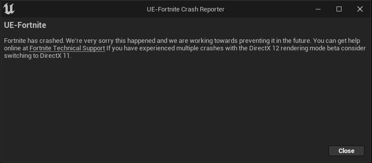

# How to install Pro Swapper Lobby

1. Download Pro Swapper from the Github page [here](https://github.com/Pro-Swapper/ProSwapperLobby/releases)
2. After downloading the ZIP file, extract it and open the executable file
3. Open ProSwapperLobby.exe and wait for Linkvertise to open
4. After doing the tasks on Linkvertise, Pro Swapper should open for you.

Before swapping anything go to Epic Games Launcher -> Fortnite -> Click the 3 dots -> Options -> **Uncheck** "High Resolution Textures"

<figure><figcaption>
Make sure you have high resolution textures turned off before swapping
</figcaption></figure>

<figure><figcaption>
You should be presented with this screen after completing the steps on Linkvertise
</figcaption></figure>

Choose a skin you own on the left box, and it shows what skins you can swap it for on the right box.

Choose a skin you want on the right box will show which skins you can swap it with on the left box

<figure><figcaption>
An example for a skin swap
</figcaption></figure>

Click convert to swap the skin and a green message box will be shown on the bottom right. To undo the swap click revert.

There is a "Swapped items" tab on the left side to give you a list of all the items you have swapped, you can also reset all these items on the same page too.

<figure><figcaption></figcaption></figure>

Now your item should be swapped
